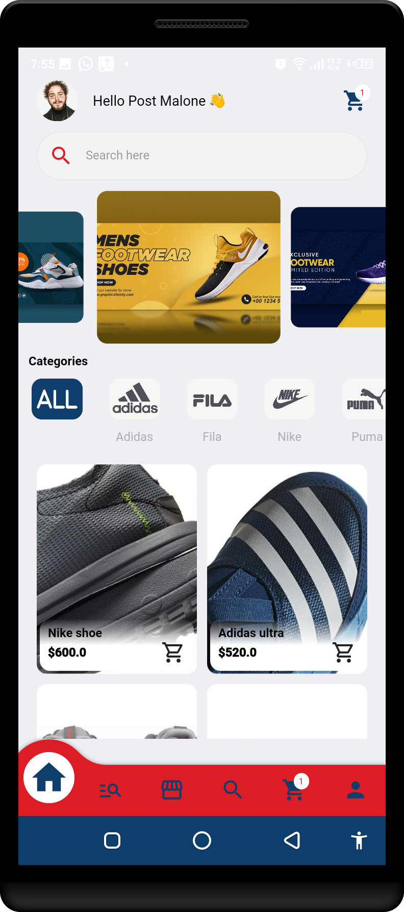
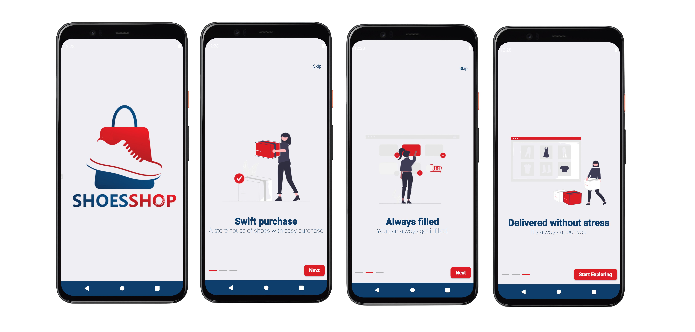
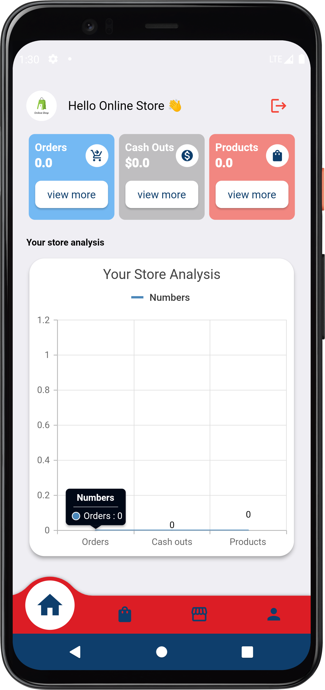

# shoes_shop Frontend

Building multivendor store for sneakers with web admin.

The store app has two sections
1. User
2. Vendor

## 🤓 Author

**Mushlihun**
 

 

It is controlled by a shop web admin currently being built with Flutter also which is at
- [ShopWebAdmin](https://github.com/mushlihun/shoesfull)

Both are built using Modern UI/UX and MVC architecture

- [Use this to get testing cards for payments](https://developer.flutterwave.com/docs/integration-guides/testing-helpers)

Color: 
primary: #DC1D25
accent: #0E3E6C